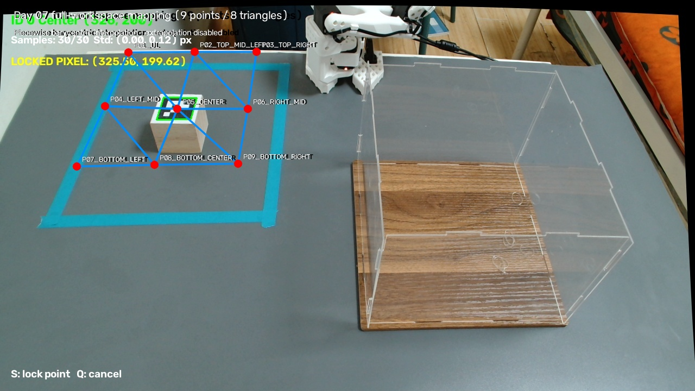

# Autonomous Robotic Grasping

## A controlled comparison of marker-based ArUco and learning-based YOLO perception for pick-and-place

**Author:** AHMED KHALIFA IDRISS ELHAJ （叶鹏）

**Affiliation:** College of Computer Science, Chengdu Normal University, Chengdu, Sichuan, China

## Demo Video

A short physical demonstration of the ArUco and YOLO autonomous robotic grasping pipelines is available on Bilibili:

**Bilibili Demo:** https://www.bilibili.com/video/BV13Xtg6REZJ/

This repository contains the publication-safe perception, calibration, mapping, detector-training metadata, evaluation, dry-run/reference, benchmark-record, analysis, and visualization artifacts for a controlled physical comparison of:

- ArUco marker-based cube pick-and-place; and
- YOLO learning-based cube pick-and-place.

Both methods achieved **100% observed full-cycle success under the controlled benchmark conditions**: 20/20 ArUco trials and 20/20 YOLO trials. This is a bounded experimental result, not a claim of universal reliability.

> **Public safety boundary:** Executable robot-actuation controllers are not distributed in this public release. The physical benchmark used archived internal experimental controllers whose provenance is retained in the audit and freeze documentation. This repository does not provide instructions for commanding robot motion.

## Research question

Under a fixed eye-to-hand camera, robot, object, workspace, destination, mapping, and benchmark protocol, how do marker-based ArUco localization and learning-based YOLO detection compare in observed full-cycle task success, cycle time, and image-space localization repeatability?

The experiment isolated the perception handoff as far as practical. Both physical pipelines used the same downstream 9-point pixel-to-joint mapping basis and substantially the same archived motion/control sequence.

## System overview

| Component | Experimental configuration |
|---|---|
| Robot | Hiwonder SO-ARM101 follower |
| Camera | Logitech C920 Pro HD Webcam |
| Camera placement | Fixed eye-to-hand |
| Image stream | 1280 × 720 at 30 FPS |
| Object | 5 cm wooden cube |
| Destination | Fixed platform/box |
| Workspace | Fixed, calibrated operating region |
| Mapping | 9 points, 8 triangles, piecewise barycentric interpolation |

The physical experiment acquired and undistorted an image, obtained a perception-specific grasp reference, rejected targets outside the validated mapping mesh, mapped the image coordinate to joint space, and used the archived internal controller to perform the benchmark cycle.

## ArUco pipeline

The marker-based pipeline used:

- ArUco marker ID 0;
- OpenCV dictionary DICT_4X4_50;
- a 40 mm marker;
- calibrated full-frame image acquisition; and
- temporally stable marker-center localization.

The five final ArUco controller variants remain preserved only in the read-only authoritative experimental archive. Their filenames and source hashes remain recorded in [SOURCE_FILE_MAP.tsv](SOURCE_FILE_MAP.tsv), marked as removed from the public release under the safety boundary. Publication-safe ArUco results and analysis remain in [results/aruco](results/aruco).

## YOLO pipeline

The learned pipeline used:

- Ultralytics YOLO26n for single-class wooden-cube detection;
- the project-specific trained checkpoint [yolo/final/model/best.pt](yolo/final/model/best.pt);
- confidence threshold 0.25;
- duplicate suppression at IoU ≥ 0.50;
- a 30-sample rolling buffer with at least 20 samples;
- per-axis stability thresholds of at most 2.0 px; and
- a global upper-quarter grasp reference derived from median bounding-box geometry.

The project-specific best.pt is retained under the repository’s AGPL-3.0-only release. The author does not claim authorship or ownership of the underlying YOLO26 architecture or Ultralytics toolchain. See [THIRD_PARTY_NOTICES.md](THIRD_PARTY_NOTICES.md).

Publication-safe YOLO perception and mapping modules, dry-run/audit materials, calibration, poses, and the checkpoint are in [yolo/final](yolo/final). The executable full-cycle controller is withheld from this public release.

## Controlled-comparison design

The official physical benchmark comprised:

- 2 perception methods;
- 5 fixed workspace locations;
- 4 trials per location per method;
- 20 trials per method; and
- 40 robotic trials in total.

The same robot, physical camera, camera mount, cube dimensions, workspace, destination, calibration, mapping support, and downstream task structure were used. Outcome counts and cycle-time statistics were computed from the frozen official records. See [docs/benchmark_protocol.md](docs/benchmark_protocol.md).

## Hardware and experimental setup

The experiment used a Hiwonder SO-ARM101 follower and a fixed eye-to-hand Logitech C920 Pro HD Webcam at 1280 × 720 and 30 FPS. The benchmark object was a 5 cm wooden cube.

The earlier ArUco run recorded OpenCV camera index 1, while Windows later enumerated the same physical camera at DirectShow index 0 for YOLO. The hardware and physical mounting position did not change. These values are reported only as experimental provenance; this public release does not provide robot-operation guidance.

## Dataset summary

The YOLO dataset contained 120 images and matching single-class labels:

| Split | Images | Share |
|---|---:|---:|
| Train | 90 | 75.0% |
| Validation | 15 | 12.5% |
| Held-out test | 15 | 12.5% |

The split was deterministic, and the held-out test set was excluded from training, validation, model selection, and tuning. **Raw images and labels are not included in this repository release.** The split manifest, dataset configuration, saved training arguments, and epoch history are in [yolo/training](yolo/training). Consequently, this release does not claim full detector-training reproducibility.

## Camera calibration

Intrinsic calibration used 20 accepted ChArUco images out of 20 found. The RMS reprojection error was **0.6122 px**. Both physical pipelines undistorted the full 1280 × 720 frame without crop, resize, flip, or rotation.

The calibration program and frozen JSON/NPZ artifacts are in [calibration/camera](calibration/camera). Raw ChArUco images are excluded.

## Pixel-to-joint mapping

The frozen Day-7 mapping used:

- 9 calibrated image-space points;
- 8 interpolation triangles;
- piecewise linear barycentric interpolation;
- automatic triangle selection; and
- no benchmark extrapolation outside the validated mesh.

The canonical model, source observations, builder, and publication-safe validator are in [mapping/final](mapping/final).

## Benchmark protocol

At each of five locations, four full pick-and-place cycles were recorded for each method. A harmonized full-cycle success required all recorded task outcome fields to be true: grip/contact accepted, release verified, cycle completed, and observed placement success. Applying this stricter harmonized definition did not change the counts because every required field was true in all 40 official rows.

Cycle-time sample standard deviation uses n − 1. Harmonized repeatability uses the arithmetic mean of each location’s four official coordinates as its empirical nominal center. Definitions and integrity rules are in [docs/benchmark_protocol.md](docs/benchmark_protocol.md).

## Main results

| Metric | ArUco | YOLO |
|---|---:|---:|
| Official trials | 20 | 20 |
| Observed successful full cycles | 20/20 | 20/20 |
| Observed success under controlled conditions | 100% | 100% |

These results do not establish universal reliability, robustness outside the mapped workspace, zero-shot generalization, or generalization to unseen objects or environments.

## Cycle-time results

| Statistic | ArUco | YOLO |
|---|---:|---:|
| Mean | 133.489 s | 133.392 s |
| Median | 133.276 s | 133.170 s |
| Sample SD | 0.752 s | 0.623 s |
| Minimum | 132.599 s | 132.722 s |
| Maximum | 135.402 s | 134.551 s |

The observed mean difference was −0.097 s for YOLO relative to ArUco. It is descriptive and does not establish YOLO speed superiority; most of the physical cycle used the same downstream sequence.

## Localization-repeatability results

| Coordinate | Mean distance | Maximum distance |
|---|---:|---:|
| ArUco marker center | 1.269 px | 3.973 px |
| YOLO bounding-box center | 1.485 px | 5.026 px |
| YOLO upper-quarter grasp reference | 1.503 px | 5.057 px |

These controlled descriptive results do not establish statistical superiority.

## YOLO held-out detector test

The detector-only held-out test was separate from the 20-trial robotic benchmark.

| Metric | Result |
|---|---:|
| Test images | 15 |
| Ground-truth cubes detected | 15/15 |
| Precision | 0.916 |
| Recall | 1.000 |
| mAP@0.5 | 0.987 |
| mAP@0.5:0.95 | 0.885 |
| Additional background false positives | 2 |
| False negatives | 0 |

No dedicated one-off test runner or saved test-run directory was found in the frozen source. The official metrics remain preserved in the comparison outputs. Because the raw test images are not included, this repository cannot independently rerun the held-out test.

## Repository structure

| Path | Contents |
|---|---|
| [aruco](aruco) | ArUco method and archived-controller provenance notes |
| [yolo](yolo) | Training metadata, evaluation utilities, publication-safe frozen modules, and model |
| [calibration](calibration) | Camera calibration code and artifacts |
| [mapping](mapping) | Frozen 9-point mapping model and validation sources |
| [results](results) | All 40 trial records, analyzers, summaries, comparison outputs, and figures |
| [docs](docs) | Setup, protocol, reproducibility, and structure documentation |
| [paper](paper) | Preprint status |

See [docs/project_structure.md](docs/project_structure.md) for the publication-safe artifact boundary.

## Reproducibility

This release supports software-environment reconstruction, artifact inspection, hash verification, trial-level result auditing, and regeneration of method summaries. Start with [docs/reproducibility.md](docs/reproducibility.md), [environment.yml](environment.yml), and [requirements.txt](requirements.txt).

It does not provide executable physical-control code, robot-operation instructions, raw training images/labels, or full detector-training reproducibility.

## Limitations

- The physical benchmark contains 20 trials per method at five fixed locations.
- The object, background, lighting, camera, robot, and destination were controlled.
- Mapping was valid only inside the calibrated mesh; benchmark extrapolation was disabled.
- The experiment evaluated one 5 cm wooden cube, not unseen object classes.
- YOLO detector metrics came from 15 held-out images, with two additional background false positives.
- Raw training and test images and labels are not included.
- A standalone held-out-test runner/output artifact was not found in the frozen source.
- Executable robot-actuation controllers are excluded from the public release.
- No inferential statistical test was used to claim method superiority.
- The experiment did not measure gripping force, torque, or current.

## Paper / preprint

**Preprint in preparation.** No arXiv identifier, DOI, venue, acceptance status, or publication date has been assigned.

## Citation

Citation metadata for the sole author is provided in [CITATION.cff](CITATION.cff).

## Third-party software and model attribution

This project uses Ultralytics YOLO26. YOLO26 and the Ultralytics toolchain were created and are maintained by Ultralytics and its contributors, not by the project author. See [THIRD_PARTY_NOTICES.md](THIRD_PARTY_NOTICES.md).

## License

This repository is licensed under the **GNU Affero General Public License v3.0 only**, SPDX identifier **AGPL-3.0-only**. See [LICENSE](LICENSE). Third-party components remain subject to their applicable upstream licenses and notices.
